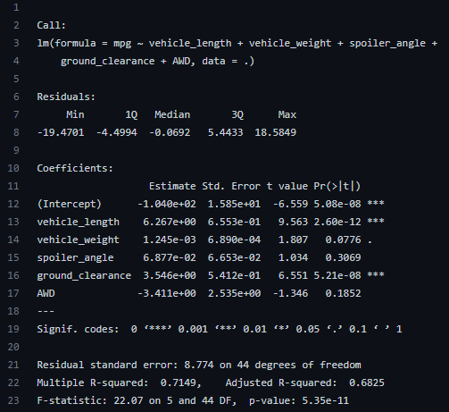
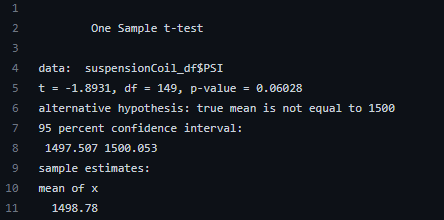
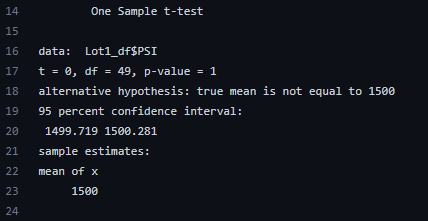
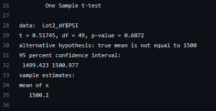
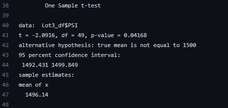

# MechaCar Statistical Analysis

## Overview
Mock exercise statistically comparing performance metrics of various versions of a vehicle prototype (MechaCar).

## Statistical Analysis
### Linear Regression to Predict MPG
According to the summary of the linear model (depicted below), the vehicle_length and ground_clearance variables provided a non-random amount of variance to the mpg values in the dataset. 

Given that the adjusted R-squared value is 0.6825, the slope of the linear model is considered to be non-zero. A slope of 0 would indicate an approximately horizontal best-fit line, which would yield an R-squared of 0. Conversely, a slope of 1 will yield an R-squared value of 1. Therefore, given our adjusted R-squared (which accounts for our multiple predictor variables) is 0.6825, we can safely say our slope is non-zero.

Finally, the summary output of the linear model suggests our model effectively predicts the mpg of MechaCar protoypes. F-statistics are a good indicator of how effectively the independant variables of the model predict the dependent variable. The further an F-statistic is from 1, the stronger the relationship between the predictor and response variables. Given that our F-statistic is 22.07, our model effectively predicts the mpg of MechaCar prototypes.

### Summary Statistics on Suspension Coils
The design specifications for the MechaCar suspension coils dictate that the variance of the suspension coils must not exceed 100 pounds per square inch. While current total manufacturing data meets this design specification (i.e. variance = 62.29), not all individual lots do so. Lots 1 and  2 meet required specs (i.e. variance of 0.98 and 7.47, respectively), Lot 3 has a variance of 170.29, which fails to meet the spec.

### T-Tests on Suspension Coils
One way t-tests were used to assess whether the PSI for each manufacturing lot is statistically different from the population mean of 1,500 pounds per square inch. 

The null hypothesis in each case is that there is no difference between sample mean and the population mean. The alternative hypothesis in each case is that there is a statistically significant difference between the sample mean and the population mean.

The t-tests for the full, Lot 1, and Lot 2 datasets failed to reject the null hypothesis (i.e. the p value > 0.05 in all cases). Screenshots of outputs are below as references.

However, the t-test for the Lot 3 data yielded a p-value of 0.04168. Because the p value < 0.05, the null hypothesis is rejected. A screenshot of the output can be seen below for reference.

## Study Design: MechaCar vs Competition
- Write a short description of a statistical study that can quantify how the MechaCar performs against the competition. In your study design, think critically about what metrics would be of interest to a consumer: for a few examples, cost, city or highway fuel efficiency, horse power, maintenance cost, or safety rating.
  - What metric or metrics are you going to test?
  - What is the null hypothesis or alternative hypothesis?
  - What statistical test would you use to test the hypothesis? And why?
  - What data is needed to run the statistical test?

## Resources
- Data
  - 
  - 
- Software
  - R
- Scripts
  - 
